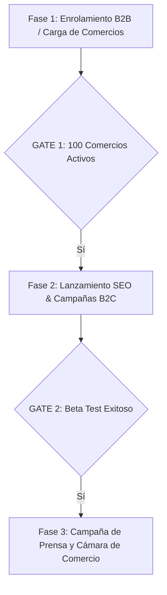

# 🗺️ ROADMAP DE LANZAMIENTO — SAN RAFAEL 360

El lanzamiento del portal está estructurado en 3 Fases secuenciales para asegurar una base sólida de comercios antes de captar al público general.

---

## 📈 FASES DE LANZAMIENTO

### 🔹 Fase 1: Enrolamiento B2B (Carga de Comercios)
*   **Objetivo:** Conseguir los primeros 100-150 comercios adheridos.
*   **Tareas Clave:**
    *   Reunión con la comisión directiva de la Cámara de Comercio.
    *   Desarrollo y testeo de la plataforma de "Reclamo de Negocio" (Claim Business).
    *   Fuerza de ventas visitando los comercios gastronómicos clave de Av. Yrigoyen.

### 🔹 Fase 2: Lanzamiento B2C & Tracción
*   **Objetivo:** Generar volumen de visitas y reseñas de usuarios reales.
*   **Tareas Clave:**
    *   Distribución del kit físico de calcomanías QR para vidrieras.
    *   Lanzamiento de campañas de Meta Ads segmentadas a turistas.
    *   Optimización de indexación SEO en Google.

### 🔹 Fase 3: Evento de Lanzamiento Oficial
*   **Objetivo:** Posicionamiento de marca y prensa masiva.
*   **Tareas Clave:**
    *   Organización de conferencia de prensa en la Cámara de Comercio.
    *   Lanzamiento cruzado: Presentación conjunta de **San Rafael 360** y la **Academia Jaditek Simracing**.
