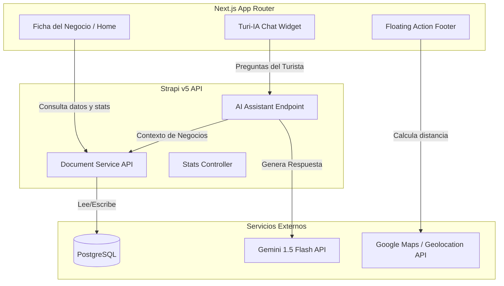

# 🧭 Master Plan de Innovación: San Rafael 360

Este documento presenta el **Plan Maestro de Innovación** para el desarrollo de **San Rafael 360**, tomando como base el análisis competitivo y el benchmarking de la aplicación móvil de **Restaurant Guru**. El objetivo es enriquecer la experiencia de usuario (UX) para el turista y potenciar la monetización de los comercios locales.

---

## 📸 Compendio del Benchmark (Restaurant Guru)

A continuación se presentan las capturas de pantalla clave extraídas del documento original, que sirvieron como base para el diseño de este plan maestro:

````carousel

<!-- slide -->

<!-- slide -->

<!-- slide -->

<!-- slide -->

<!-- slide -->

<!-- slide -->

<!-- slide -->

````

---

## 📊 Matriz Comparativa de Funcionalidades

| Funcionalidad / Módulo | Restaurant Guru | San Rafael 360 (Estado Actual) | Propuesta Master Plan (SR360) |
| :--- | :--- | :--- | :--- |
| **Búsqueda e Interfaz** | Categorías en carrusel + Buscador + Botón IA | Filtros de texto, categorías y geolocalización | Sincronización PWA nativa, Botón de búsqueda por voz y Asistente IA permanente. |
| **Asistente de IA** | Integrado en menú y Home (Chef / Asistente) | No posee | **Turi-IA**: Chatbot de turismo local entrenado con datos del backend (Gemini API). |
| **Ficha del Comercio** | Header visual (carrusel temporizado), rango de precio, tags de cocina | Logo, portada estática, horarios, atributos y reviews | Carrusel temporizado de fotos (Premium) estilo Instagram Stories, Footer de acción rápida y rango de precio estimado. |
| **Opiniones y Puntuaciones**| Agregador (Google + TripAdvisor) + Detalle de Comida/Servicio/Ambiente | Módulo de reseñas nativo | Módulo nativo potenciado con filtros por platos destacados y desglose de calificaciones. |
| **Información y Comodidades**| Listado de amenities con iconos (Wifi, reservas, accesibilidad, etc.) | Atributos simples por tags | Taxonomía avanzada de amenities con diseño iconográfico integrado (Obsidian UI). |
| **Descubrimiento y Navegación**| Recomendador de "Similares cercanos" | Búsqueda por mapa | Carrusel dinámico de comercios recomendados al pie de cada ficha. |

---

## 🎯 Pilares Estratégicos del Master Plan

### Pilar 1: Turi-IA (Asistente Conversacional Inteligente)
Inspirado en el asistente de IA de Restaurant Guru, se propone la integración de **Turi-IA**, un chatbot interactivo especializado en turismo para San Rafael:
*   **Tecnología:** Gemini API a través del SDK de Antigravity o Firebase AI Logic.
*   **Funcionalidad:** Los usuarios pueden hacer preguntas complejas como: *"¿Qué restaurante de pastas tiene terraza abierta ahora?"* o *"Recomendame cabañas en Valle Grande que acepten mascotas y tengan pileta"*.
*   **Integración de Datos:** El bot lee en tiempo real el catálogo de Strapi (horarios, amenities, categorías) para dar respuestas 100% exactas y geolocalizadas.

### Pilar 2: Ficha Comercial Enriquecida y Footer de Acción Rápida
Replicar la alta conversión que genera la UI de Restaurant Guru mediante accesos rápidos e información de valor inmediata:
*   **Carrusel Temporizado de Fotos (Estilo Stories):** En el encabezado (`BusinessHero.tsx`), los comercios Premium contarán con un carrusel dinámico auto-reproducible. Tendrá barras de progreso horizontales y segmentadas (estilo Instagram Stories) que se llenan secuencialmente y permiten navegación manual táctil (taps laterales) y pausa al mantener presionado.
*   **Floating Action Footer:** En celulares, un pie de página fijo con 3 botones de alta conversión: **Llamar**, **Cómo llegar** (mostrando la distancia en km calculada por GPS local) y **Menú/Reservar** (redirigiendo a WhatsApp o carta digital).
*   **Estimador de Gasto ($$$$):** Rango de precios por persona (Económico, Moderado, Medio-Alto, Alto) basado en la carga del propietario.
*   **Consolidación de Reputación:** Mostrar el promedio y cantidad de calificaciones nativas complementadas con badges de reputación externa (Google / TripAdvisor).

### Pilar 3: Taxonomía de Amenities y Extracción de Platos Populares
*   **Amenities con Iconografía Obsidian:** Un bloque visual con iconos premium (Obsidian & Gold) para identificar servicios clave (Wifi, Estacionamiento, Aire Libre, Tarjetas, Accesibilidad).
*   **Filtros por Platos Populares:** Analizar mediante IA los comentarios nativos del negocio para extraer los platos más mencionados (ej: "lomo", "empanadas") y listarlos como tags rápidos con carita sonrientes para filtrar opiniones.

### Pilar 4: Motor de Recomendación y Similitud
*   **Comercios Similares Cercanos:** Un algoritmo sencillo en el backend que al pie de cada negocio recomiende locales de la misma categoría o distrito que tengan valoraciones similares, incentivando al turista a seguir descubriendo opciones dentro de la plataforma.

---

## 🗺️ Flujo de Datos y Arquitectura de la Propuesta

El siguiente diagrama visualiza cómo interactúan los componentes del frontend de Next.js, el backend en Strapi y los servicios externos de IA y base de datos:



---

## 📅 Plan de Ejecución por Fases

### Fase 1: Optimización de UX y Conversión (Corto Plazo - 2 a 3 semanas)
*   **Implementación:**
    *   Diseño y desarrollo del **Floating Action Footer** en el detalle del negocio para celulares.
    *   Integración de geolocalización del usuario para calcular la distancia en kilómetros hacia el comercio.
    *   Maquetado del bloque visual de **Amenities** con la iconografía del Obsidian Design System.

### Fase 2: Enriquecimiento de Datos y Reputación (Mediano Plazo - 3 semanas)
*   **Implementación:**
    *   Integración del campo "Rango de Precios" en Strapi y frontend.
    *   Filtros avanzados en la Home por tipo de establecimiento y cocina.
    *   Desglose de reviews nativas por categorías (Comida, Atención, Ambiente).

### Fase 3: Inteligencia Artificial (Largo Plazo - 4 semanas)
*   **Implementación:**
    *   Desarrollo del endpoint en Strapi que conecta con Gemini para alimentar el contexto de los comercios.
    *   Diseño del widget interactivo de chat **Turi-IA** en el frontend.
    *   Extracción automática de "platos populares" a partir de reviews mediante análisis de sentimiento con IA.
