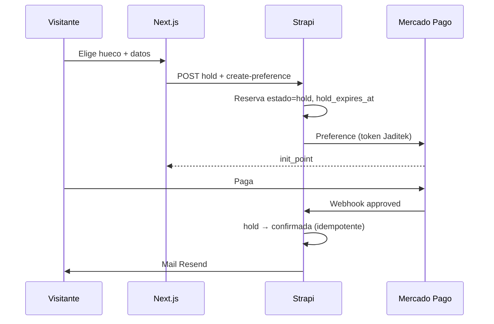

# Plan de implementación — módulo de reservas (MVP)

**Estado:** MVP local PR1–PR5 implementados (31 jul 2026) · rama `develop`.  
**Ambiente:** solo local/dev · rama `develop` · sin push a `master` · sin deploys.  
**Base de producto:** [alcance-mvp.md](alcance-mvp.md) · [decisiones.md](decisiones.md) (RES-DEC-001…008) · [primer-cliente-jaditek.md](primer-cliente-jaditek.md).

---

## 0. Auditoría (sesión actual)

| Ítem | Hallazgo |
|------|----------|
| Rama | `develop` (local, al día con `origin/develop`) |
| Motor de turnos | **No existe** en código. Solo CTA externa (`reserva_url` / `BookingWidget`) |
| MP hoy | Preferencia → checkout → webhook firmado → `processPaymentSuccess` activa **premium** de `negocio` |
| Reembolsos MP | **No hay** código de refund; hay que construir el spike |
| Auth admin | NextAuth + Strapi JWT; lista Diego / María Laura ya en `frontend/src/lib/admin-emails.ts` y `ADMIN_EMAILS` en backend — encaja RES-DEC-005 |
| Mails | Resend vía `strapi-provider-email-resend` + `notification-service.ts` |
| Dominio directorio | No reutilizar `negocio` / Algolia / premium para la agenda (RES-DEC-003, complejidad-y-stack) |

---

## 1. Principios de diseño (no negociables)

1. **Dominio separado** del directorio: content-types propios (`reserva-*`), sin FK obligatoria a `negocio`.
2. **Multi-comercio desde el día 1** (RES-DEC-004): toda fila lleva `comercio`; seed = Jaditek.
3. **Firme solo con pago** (RES-DEC-002); excepción solo walk-in / override admin explícito.
4. **Capas STANDARDS:** Routes → Validators → Controllers (`asyncHandler`) → Services → Repositories. Sin fat controllers.
5. **Reusar el bucle MP**, no el side-effect de premium: preferencia → checkout → webhook → confirmar **reserva**.
6. **Sin inventar** fuera de alcance-mvp / RES-DEC. Gaps → preguntas al final.

---

## 2. Modelo de datos propuesto

Slots **no se materializan** en tabla: se calculan al vuelo desde horario − ocupaciones − bloqueos. Evita sync y sobreventa se controla en hold/confirm con constraint de unicidad lógica.

### 2.1 `reserva-comercio` (collection)

Todo lo operativo es **configurable por comercio** (no hardcode Jaditek en lógica).

| Campo | Tipo | Notas / default seed Jaditek |
|-------|------|------------------------------|
| `nombre` | string | Jaditek Sim Racing |
| `slug` | uid | `jaditek` → `/reservas/jaditek` |
| `activo` | boolean | true |
| `timezone` | string | `America/Argentina/Mendoza` |
| `duracion_minutos` | integer | **60** (configurable; Jaditek arranca en 1 h) |
| `buffer_limpieza_minutos` | integer | **0** al inicio; si >0, el hueco siguiente no se vende hasta fin+buffer |
| `anticipacion_llegada_minutos` | integer | **15** |
| `texto_llegada` | text | “Llegá 15 min antes…” |
| `precio_ars` | decimal | configurable / editable en admin; seed con placeholder (ej. `15000`) hasta definir precio real |
| `horario` | json | ver §2.5 — default **lun–sáb 16:00–22:00** |
| `cancelacion_horas_minimas` | integer | **24** — self-service / política solo si falta ≥ N horas |
| `cancelacion_politica` | json | cargos/reembolso parametrizable (ver §2.7) |
| `logo` / `imagen_portada` | media | mismo patrón que ficha `negocio` (§2.8) |
| `nombre_publico` | string opcional | fallback a `nombre` |
| `mp_token_env` | string | ej. `MP_ACCESS_TOKEN_JADITEK` — **Diego carga el token** en `.env` local |
| `hold_ttl_minutos` | integer | **15** — tiempo que el hueco queda en espera mientras paga en MP |

Sin onboarding self-service (fuera de MVP).

### 2.2 `reserva-recurso` (collection)

| Campo | Tipo | Notas |
|-------|------|--------|
| `comercio` | relation → comercio | |
| `nombre` | string | “Puesto 1”… |
| `orden` | integer | |
| `activo` | boolean | |

Seed Jaditek: **4** recursos.

### 2.3 `reserva` (collection) — ocupación vendible

| Campo | Tipo | Notas |
|-------|------|--------|
| `comercio` | relation | |
| `recurso` | relation | |
| `inicio` / `fin` | datetime | fin = inicio + duración |
| `estado` | enum | `hold` \| `confirmada` \| `cancelada` \| `expirada` |
| `origen` | enum | `online` \| `walk_in` \| `admin` |
| `cliente_nombre` / `email` / `telefono` | string | |
| `hold_expires_at` | datetime | solo `hold` |
| `monto_ars` | decimal | |
| `excepcion_sin_pago` | boolean | solo admin; walk-in sin MP |
| `mp_preference_id` / `mp_payment_id` | string | |
| `cancelada_at` | datetime | |
| `mp_refund_id` | string | si hubo reembolso |
| `codigo` | string | corto para mail / soporte |

**Reglas:**

- Público online: crea `hold` + preferencia MP; sin pago aprobado → nunca `confirmada`.
- Job/cron (o sweep en lectura de disponibilidad): `hold` con `hold_expires_at < now` → `expirada` (libera hueco).
- Unicidad lógica: no dos filas (`confirmada`|`hold` vigente) con mismo `recurso` + solapamiento de `[inicio, fin)`.

### 2.4 `reserva-bloqueo` (collection)

| Campo | Tipo | Notas |
|-------|------|--------|
| `comercio` | relation | |
| `recurso` | relation opcional | `null` = todos los recursos del comercio en esa franja |
| `inicio` / `fin` | datetime | |
| `motivo` | string | interno admin |

Público / grilla: franja con bloqueo o reserva firme/hold vigente → **no disponible** (mismo aspecto; no se distingue “vendido” vs “bloqueado” al visitante).

### 2.5 `horario` (JSON en comercio) — configurable

Default seed Jaditek:

```json
{
  "dias": {
    "1": [{ "inicio": "16:00", "fin": "22:00" }],
    "2": [{ "inicio": "16:00", "fin": "22:00" }],
    "3": [{ "inicio": "16:00", "fin": "22:00" }],
    "4": [{ "inicio": "16:00", "fin": "22:00" }],
    "5": [{ "inicio": "16:00", "fin": "22:00" }],
    "6": [{ "inicio": "16:00", "fin": "22:00" }],
    "0": []
  }
}
```

`0`=domingo … `6`=sábado. Huecos = `duracion_minutos` dentro de cada tramo; entre fin de un turno y el próximo vendible se suma `buffer_limpieza_minutos` (0 = contiguos).

### 2.6 Pagos: no mezclar con `api::pago.pago`

El content-type `pago` actual está acoplado a `negocio` + premium. Para reservas:

- Preferencia/webhook **nuevos** bajo API de reservas (`/api/reservas/...`).
- Persistencia de IDs MP en la fila `reserva` (MVP). Si hace falta auditoría fina después, se agrega `reserva-pago` sin tocar premium.

### 2.7 Política de cancelación (parametrizable + MP)

Ventana: cancelar (self-service por **link en mail** o admin) con política automática si `inicio - now >= cancelacion_horas_minimas` (default **24 h**).

`cancelacion_politica` (JSON por comercio):

```json
{
  "dentro_ventana": {
    "reembolso_porcentaje": 100,
    "cargo_fijo_ars": 0
  },
  "fuera_ventana": {
    "permitir_self_service": false,
    "reembolso_porcentaje": 0,
    "cargo_fijo_ars": null
  }
}
```

- Seed Jaditek: **100% reembolso** dentro de 24 h; fuera → sin self-service (admin a mano).
- Para **no reembolsar**: setear `reembolso_porcentaje: 0` (y/o cargo) en la política del comercio — sin cambiar código.
- Refund vía API MP cuando el % > 0; si es 0, solo cancela y libera hueco.

### 2.8 Piel / branding — reutilizar ficha de negocio

No reinventar theme builder. Misma idea que `negocio`:

| Campo | Igual que en directorio |
|-------|-------------------------|
| `logo` | media Strapi (como `negocio.logo`) |
| `imagen_portada` | media Strapi (como `negocio.imagen_portada`) |
| `nombre_publico` | título en la página (opcional; fallback a `nombre`) |

Upload admin: mismo patrón portal (`FormData` + upload Strapi / flujo ya usado en `EditBusinessForm` para logo y portada).  
Página pública `/reservas/[slug]`: portada + logo como ancla visual (misma familia UX que la ficha, sin copiar Algolia/discovery).

---

## 3. Dónde vive cada pieza

| Pieza | Strapi (backend) | Next.js (frontend) |
|-------|------------------|--------------------|
| Schema comercio / recurso / reserva / bloqueo | content-types + seed | — |
| Disponibilidad (cálculo huecos) | service + repo + `GET` público | grilla Server/Client |
| Crear hold + preferencia MP | service (token del comercio) | checkout redirect |
| Webhook MP | route + firma HMAC (patrón `mercadopago-webhook`) → confirmar reserva | back_urls éxito/error |
| Liberar holds vencidos | service + cron Strapi o sweep en `GET` disponibilidad | — |
| Admin agenda / walk-in / bloqueo / cancelar | routes `require-admin` | `/portal/reservas` o `/reservas/admin/[slug]` |
| Cancelación (ventana + política) + refund MP | service + token cancelación firmado | link en mail + admin |
| Mail confirmación / cancelación | templates + link cancel self-service | — |
| Piel logo/portada | media fields + upload (patrón ficha) | `/reservas/[slug]` + admin upload |
| Seed Jaditek | bootstrap/seed script local | — |

**Rutas públicas propuestas**

- `/reservas/[slug]` — grilla + checkout  
- `/reservas/[slug]/exito` · `/reservas/[slug]/pending` · `/fallo` — post-MP  

**Rutas admin propuestas**

- `/portal/reservas` — lista comercios (MVP: Jaditek)  
- `/portal/reservas/[slug]` — agenda día/semana, walk-in, bloqueos, cancelar  

Gate: mismos admins soberanos (Diego + María Laura). Sin roles de empleados (RES-DEC-005).

---

## 4. Flujos (MVP)



Admin walk-in: `confirmada` + `origen=walk_in` (+ `excepcion_sin_pago` o cobro MP aparte si se pide en UI).  
Bloqueo: inserta `reserva-bloqueo` → celda **no disponible** en grilla.  
Cancelación dentro de ventana: aplica `cancelacion_politica` → refund MP (parcial/total) → `cancelada` → libera hueco.

---

## 5. Spikes (antes o en el primer PR de pagos)

| ID | Objetivo | Criterio de done |
|----|----------|------------------|
| **S1** | Preferencia MP con `external_reference` = `reserva.documentId` + metadata `tipo=reserva` | Preferencia creada en sandbox Jaditek |
| **S2** | Webhook → confirmar reserva (no tocar premium) | Idempotente por `mp_payment_id`; hold ajeno no confirma |
| **S3** | Refund MP (total/parcial según política) | Reembolso en sandbox; `mp_refund_id` + monto guardados |
| **S4** | Token por comercio (`mp_token_env`) | Jaditek no usa el token de premium SR360 |

Patrón a copiar (no el side-effect): `backend/src/api/pago/services/pago.ts`, `mercadopago-webhook.ts`, `payment-success-handler.ts` → nuevo `reservation-payment-success-handler.ts`.

---

## 6. Orden de PRs / vertical slices (chicos)

Cada slice mergeable en `develop`, testeable en local.

| PR | Slice | Entrega |
|----|-------|---------|
| **PR1** | Fundación datos | ✅ Schemas + seed Jaditek verificado en local (`/api/reserva-comercios`) |
| **PR2** | Disponibilidad + piel | ✅ API + `/reservas/[slug]` (grilla 7 días, sin checkout) |
| **PR3** | Hold + MP | ✅ Checkout + simulación local + webhook routes (MP real pendiente de token) |
| **PR4** | Admin mínimo | ✅ `/portal/reservas` agenda + walk-in + bloqueos + cancel (refund MP en PR5) |
| **PR5** | Cancel + mail | ✅ Link cancel + política/reembolso MP + mails confirmación/cancelación |

Fuera de MVP: gift cards, membresías, onboarding self-service masivo, split/marketplace, Assetto, waitlist, app nativa.  
**Sí entra como configurable (default 0):** buffer de limpieza — no “auto mágico”, sino campo del comercio.

---

## 7. Cómo probar en local / MP sandbox

### 7.1 Stack local

```bash
# backend
cd backend && npm run dev   # :1337
# frontend
cd frontend && npm run dev  # :3000
```

Env (solo `.env` local, no prod):

- `MP_ACCESS_TOKEN_JADITEK` — Access Token **de prueba** de la cuenta MP Jaditek  
- `MP_WEBHOOK_SECRET` — o skip controlado en `NODE_ENV=development` (mismo patrón premium)  
- `BACKEND_URL` — si webhook real: túnel (`cloudflared` / ngrok) apuntando a `:1337`  
- `FRONTEND_URL=http://localhost:3000`  
- `RESEND_API_KEY` — o log-only en dev si ya hay flag  
- `ADMIN_EMAILS` — emails Diego + María Laura  

Pasos concretos del switch sim → sandbox: [mp-sandbox-runbook.md](mp-sandbox-runbook.md).

### 7.2 Modos de prueba (propuestos)

1. **`modo_simulacion` en comercio** (análogo a `suscripcion-config.modo_prueba`): hold → confirmada sin MP; back_url local. Ideal CI / demos sin túnel.  
2. **Sandbox MP real:** preferencia + tarjetas de prueba MP + webhook vía túnel.  
3. **`POST /api/reservas/simulate-success`** — solo no-production (espejo de `/pagos/simulate-success`).

### 7.3 Checklist funcional (criterio “listo Jaditek” del alcance)

- [ ] Link `/reservas/jaditek` muestra huecos 1 h × 4 recursos según horario seed  
- [ ] Pago (o simulación) confirma y no permite doble venta del mismo hueco  
- [ ] Admin bloquea → deja de verse online  
- [ ] Admin walk-in ocupa hueco  
- [ ] Cancel dentro de 24 h aplica política (reembolso MP sandbox) y libera  

- [ ] Solo Diego y María Laura entran al panel  

---

## 8. Riesgos técnicos (aviso)

| Riesgo | Mitigación |
|--------|------------|
| Sobreventa en race hold/webhook | Transacción / lock en service + rechazo si solapa; webhook idempotente |
| Mezclar premium y reservas en mismo webhook | Rutas y handlers **separados**; nunca reutilizar `processPaymentSuccess` de premium |
| Token MP de plataforma vs Jaditek | `mp_token_env` por comercio (RES-DEC-008) |
| Webhook inalcanzable en localhost | Túnel **o** modo simulación (obligatorio en PR3) |
| Refund inexistente hoy | Spike S3 antes de cerrar PR5 |

---

## 9. Decisiones cerradas (esta ronda) vs pendientes

### Cerrado

| Tema | Decisión |
|------|----------|
| Precio / horario / duración / buffer limpieza | **Configurables** por comercio |
| Seed Jaditek horario | Lun–sáb **16:00–22:00**; domingo cerrado |
| Duración seed | **60 min** |
| Buffer limpieza seed | **0** |
| Cancelación | Hasta **24 h** antes; política de cargos/reembolso **parametrizable**; refund vía MP |
| Piel | **Configurable por cliente** (Jaditek primero) |
| Bloqueo | Visible en grilla como **no disponible** |
| Token MP Jaditek | **Diego** lo carga en `.env` cuando toque pagos |
| Hold TTL | **15 minutos** (campo `hold_ttl_minutos`, configurable) |
| Cancel self-service | **Link en mail** (token firmado) |
| Reembolso default | **100%** dentro de 24 h; `reembolso_porcentaje: 0` = no reembolsar (param) |
| Piel | Reutilizar patrón ficha: **`logo` + `imagen_portada`** (media Strapi + upload portal) |

### Pendientes de producto

Ninguno bloqueante para PR1. Precio seed = placeholder editable.

---

## 10. Criterio de salida de planning

- [x] Docs del módulo leídos  
- [x] MP / auth / mail ubicados en el repo  
- [x] Rama `develop` + trabajo local  
- [x] `implementation_plan.md` cerrado en config / hold / cancel / piel  
- [ ] **“Adelante”** → ejecutar PR1 en local  

**No se escribe código de producto hasta tu OK.**
